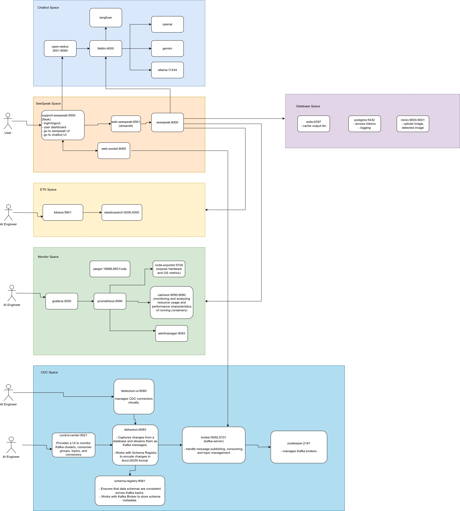

# SeeSpeak
SeeSpeak is a user-friendly application designed to support Vietnamese learners in mastering English. With its intuitive interface and clear visuals, the app helps users recall and learn new vocabulary related to everyday objects and actions. By connecting language learning with the images we encounter daily, SeeSpeak makes the process enjoyable and effective, turning language acquisition into a seamless part of your daily life.

# Architecture

# UI

